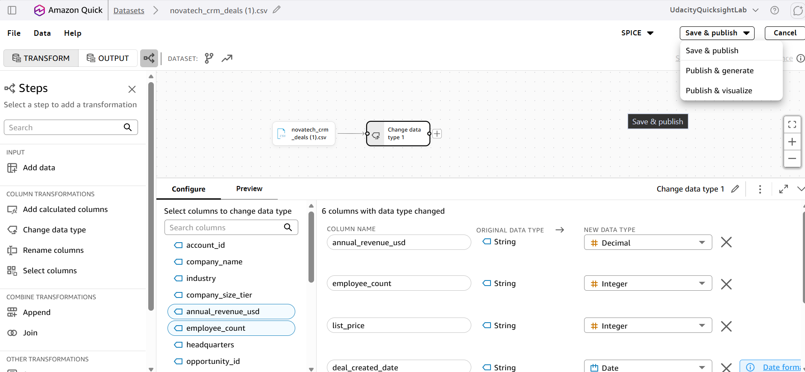
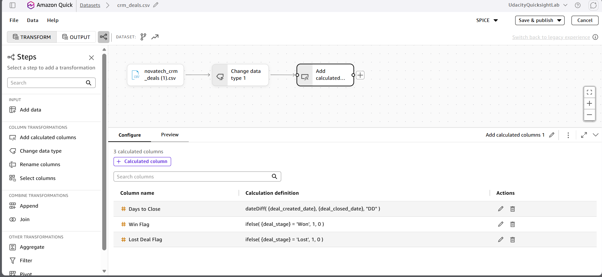

# Revenue Intelligence Dashboard for NovaTech Solutions

## Submission Requirements & Screenshot Evidence

The criteria and submission requirements below are transcribed from the supplied rubric. Add your evidence in the screenshot space beneath each requirement.

To attach screenshots, edit this README on GitHub and paste or drag your images into the matching space. Replace the *Attach screenshots here* placeholder with the uploaded image Markdown. Add multiple screenshots in the same space when needed.

---

## Data Quality & Preparation

### Criterion 1: Verify data quality and completeness across indexed knowledge bases

**Submission requirements**

1. Verification log contains at least 6 entries covering all three data knowledge bases (CRM deals, marketing campaigns, support tickets)

   **Screenshot evidence:**

   > *Attach screenshots here.*

   <!-- Screenshot space: criterion 1, requirement 1. Paste uploaded image Markdown below this comment. -->

     

2. Each log entry includes a natural language question, Q's response, the expected answer from the data dictionary, and a pass/fail assessment

   **Screenshot evidence:**

   > *Attach screenshots here.*

   <!-- Screenshot space: criterion 1, requirement 2. Paste uploaded image Markdown below this comment. -->

     

3. Verification log questions target checkable facts such as row counts, distinct values, date ranges, or known null counts

   **Screenshot evidence:**

   > *Attach screenshots here.*

   <!-- Screenshot space: criterion 1, requirement 3. Paste uploaded image Markdown below this comment. -->

     

4. Screenshots show all three CSV datasets successfully imported into SPICE with correct row counts and column counts

   **Screenshot evidence:**

   > *Attach screenshots here.*

   <!-- Screenshot space: criterion 1, requirement 4. Paste uploaded image Markdown below this comment. -->

     

### Criterion 2: Transform and join datasets using no-code data preparation tools

**Submission requirements**

1. Screenshots show data type corrections applied to at least one dataset

   **Screenshot evidence:**

   

     

2. At least two calculated fields use business logic (e.g., days-to-close, campaign ROI, ticket frequency)

   **Screenshot evidence:**

   

     

3. A unified dataset joins all three data sources on a shared key, with the join diagram and join configuration visible in screenshots

   **Screenshot evidence:**

   > *Attach screenshots here.*

   <!-- Screenshot space: criterion 2, requirement 3. Paste uploaded image Markdown below this comment. -->

     

4. Screenshots or report text identify the anchor table and join type used for the unified dataset

   **Screenshot evidence:**

   > *Attach screenshots here.*

   <!-- Screenshot space: criterion 2, requirement 4. Paste uploaded image Markdown below this comment. -->

     

5. All four datasets (three source + one unified) are saved to SPICE

   **Screenshot evidence:**

   > *Attach screenshots here.*

   <!-- Screenshot space: criterion 2, requirement 5. Paste uploaded image Markdown below this comment. -->

     

---

## Dashboard Design & Interactivity

### Criterion 3: Design and build a multi-page interactive dashboard for business decision-making

**Submission requirements**

1. Dashboard contains three sheets: Marketing Funnel, Sales Pipeline, and Customer Health

   **Screenshot evidence:**

   > *Attach screenshots here.*

   <!-- Screenshot space: criterion 3, requirement 1. Paste uploaded image Markdown below this comment. -->

     

2. Each sheet includes at least one KPI summary card and multiple visualizations appropriate to the business questions

   **Screenshot evidence:**

   > *Attach screenshots here.*

   <!-- Screenshot space: criterion 3, requirement 2. Paste uploaded image Markdown below this comment. -->

     

3. The Customer Health sheet includes at least one visual built from the unified (joined) dataset

   **Screenshot evidence:**

   > *Attach screenshots here.*

   <!-- Screenshot space: criterion 3, requirement 3. Paste uploaded image Markdown below this comment. -->

     

4. At least two sheets include interactive filter controls

   **Screenshot evidence:**

   > *Attach screenshots here.*

   <!-- Screenshot space: criterion 3, requirement 4. Paste uploaded image Markdown below this comment. -->

     

5. At least one sheet includes a one-click filtering action on two or more visuals

   **Screenshot evidence:**

   > *Attach screenshots here.*

   <!-- Screenshot space: criterion 3, requirement 5. Paste uploaded image Markdown below this comment. -->

     

6. At least one cross-sheet navigation action links between sheets

   **Screenshot evidence:**

   > *Attach screenshots here.*

   <!-- Screenshot space: criterion 3, requirement 6. Paste uploaded image Markdown below this comment. -->

     

7. Dashboard is published and exported as a PDF covering all three sheets

   **Screenshot evidence:**

   > *Attach screenshots here.*

   <!-- Screenshot space: criterion 3, requirement 7. Paste uploaded image Markdown below this comment. -->

     

---

## AI-Powered Analysis & Communication

### Criterion 4: Configure and use AI-powered natural language querying to explore data

**Submission requirements**

1. Screenshots show baseline Quick Chat interaction (2–3 questions asked before Topic configuration)

   **Screenshot evidence:**

   > *Attach screenshots here.*

   <!-- Screenshot space: criterion 4, requirement 1. Paste uploaded image Markdown below this comment. -->

     

2. A Topic is configured, and screenshots show the Topic setup

   **Screenshot evidence:**

   > *Attach screenshots here.*

   <!-- Screenshot space: criterion 4, requirement 2. Paste uploaded image Markdown below this comment. -->

     

3. Post-Topic screenshots show the same 2–3 baseline questions re-asked with improved or changed responses

   **Screenshot evidence:**

   > *Attach screenshots here.*

   <!-- Screenshot space: criterion 4, requirement 3. Paste uploaded image Markdown below this comment. -->

     

4. Q Exploration Log contains at least 5 entries spanning all three data domains, including at least one cross-dataset question

   **Screenshot evidence:**

   > *Attach screenshots here.*

   <!-- Screenshot space: criterion 4, requirement 4. Paste uploaded image Markdown below this comment. -->

     

5. Each log entry includes the question asked, Q's response, and verification against the dashboard

   **Screenshot evidence:**

   > *Attach screenshots here.*

   <!-- Screenshot space: criterion 4, requirement 5. Paste uploaded image Markdown below this comment. -->

     

### Criterion 5: Extract and communicate data-driven business insights to stakeholders

**Submission requirements**

1. Dashboard includes 3–5 text annotations visible on the dashboard sheets

   **Screenshot evidence:**

   > *Attach screenshots here.*

   <!-- Screenshot space: criterion 5, requirement 1. Paste uploaded image Markdown below this comment. -->

     

2. Each annotation states a quantified finding, a business implication, and a recommended action

   **Screenshot evidence:**

   > *Attach screenshots here.*

   <!-- Screenshot space: criterion 5, requirement 2. Paste uploaded image Markdown below this comment. -->

     

3. Written report for VP Sarah Chen is 1–3 pages and covers: data strategy, dashboard design rationale, how Topic configuration affected Q accuracy, key insights with recommended actions, and where AI analysis agreed or disagreed with the dashboard

   **Screenshot evidence:**

   > *Attach screenshots here.*

   <!-- Screenshot space: criterion 5, requirement 3. Paste uploaded image Markdown below this comment. -->

     

4. Report defines technical terms on first use, contains no raw SQL or formulas, and uses complete sentences

   **Screenshot evidence:**

   > *Attach screenshots here.*

   <!-- Screenshot space: criterion 5, requirement 4. Paste uploaded image Markdown below this comment. -->

     
