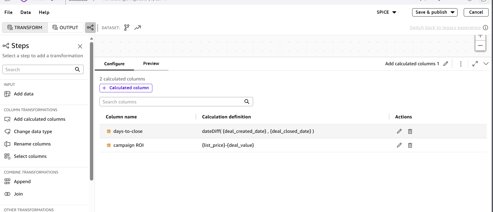
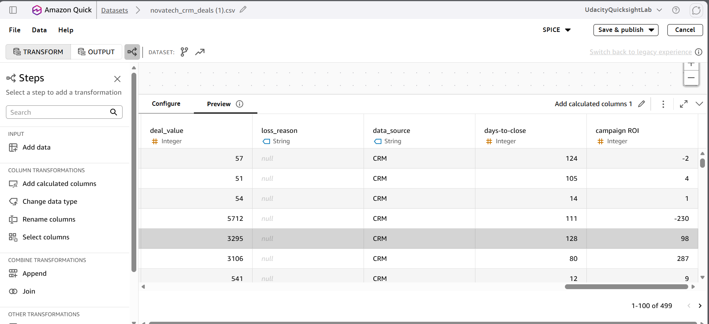

# Screenshots show data type corrections applied to at least one dataset

## At least two calculated fields use business logic (e.g., days-to-close, campaign ROI, ticket frequency)

**Validation note:** These screenshots show two calculated fields. The field labeled `campaign ROI` currently uses `{list_price}-{deal_value}`, which measures the difference between list price and deal value, not campaign ROI. To represent campaign ROI, use marketing revenue and spend: `(revenue_attributed - campaign_spend) / campaign_spend`, with zero-spend handling. For campaign-level reporting, calculate ROI from summed revenue and summed spend. The screenshots are preserved as supplied; this correction is still pending in QuickSight.
